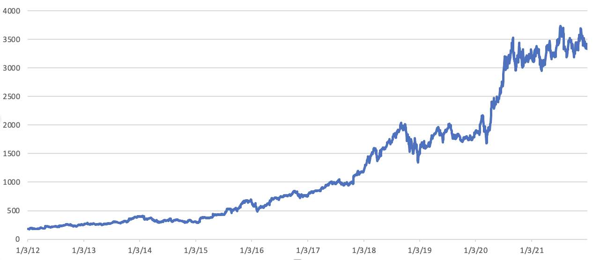

### AMZN Stock Vesting Growth

#### Stock Price

Last 10 years of AMZN stock [raw data](data/amzn.csv) from [IEX](https://iexcloud.io/).

#### YoY Averages on Date of Vesting

Average yoy compounded stock growth and yoy non-componded stock growth, on vesting date, with AMZN schedule via [yoy.rb](yoy.rb). See [raw data](data/yoy.csv). 

Every blue point in this graph shows the stock price growth in % compared to the previous year, and in orange the stock price growth in % compared to one's grant date, at the time of stock vesting averaged for the year when the stock vested.

